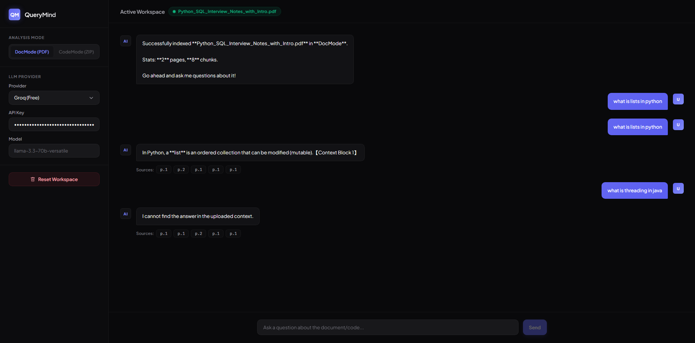

# QueryMind 🧠

> AI-powered Document & Code Intelligence — upload any PDF or codebase, ask questions in natural language, and get grounded, source-cited answers.

<p align="center">
  <a href="https://papermind-peach.vercel.app"><strong>🚀 Live Demo</strong></a> ·
  <a href="#quick-start"><strong>📦 Quick Start</strong></a> ·
  <a href="#architecture"><strong>🏗️ Architecture</strong></a> ·
  <a href="#the-production-story"><strong>🐛 Production Story</strong></a>
</p>

---

## What it does

QueryMind is a Retrieval-Augmented Generation (RAG) application that lets users upload documents (PDFs) or source code repositories and ask natural-language questions. Instead of relying on the LLM's training data, it retrieves relevant chunks from your uploaded content and constrains answers strictly to that context — eliminating hallucinations and providing source citations.

**Key capabilities:**

- 📄 **PDF Q&A** — Upload any PDF and chat with its contents
- 💻 **Codebase Q&A** — Upload ZIP files or individual code files; language-aware chunking preserves function/class boundaries
- 🔍 **Source Citations** — Every answer includes clickable references to the exact chunks used
- ⚡ **Multi-LLM Support** — Groq, Ollama (local), Gemini, Claude — switch providers without re-indexing
- 🚀 **Production Deployed** — Frontend on Vercel, backend on Render, vector DB persisted locally

---

## Architecture

```
┌─────────────┐     ┌─────────────────┐     ┌─────────────────┐
│   React 19  │───▶│   FastAPI       │────▶│  ChromaDB        │
│   (Vite)    │◀───│   (Python 3.13) │◀────│  (Vector Store)  │
└─────────────┘     └─────────────────┘     └─────────────────┘
                            │
                    ┌───────┴───────┐
                    ▼               ▼
            ┌──────────┐    ┌──────────────┐
            │ PyMuPDF  │    │  HuggingFace │
            │ Chunker  │    │  Embeddings  │
            │ (ONNX)   │    │  (384-dim)   │
            └──────────┘    └──────────────┘
                    │
                    ▼
            ┌──────────────┐
            │ Groq / Ollama│
            │ Gemini /     │
            │ Claude       │
            └──────────────┘
```

### Tech Stack

| Layer | Technology |
|---|---|
| Frontend | React 19, Vite, Tailwind CSS |
| Backend | FastAPI, Python 3.13 |
| Vector DB | ChromaDB (persistent, local) |
| Embeddings | `all-MiniLM-L6-v2` (local, offline, ONNX Runtime) |
| PDF Parsing | PyMuPDF |
| Code Chunking | LangChain language-aware splitters (13 languages) |
| LLM Providers | Groq API, Ollama, Google Gemini, Anthropic Claude |
| Deployment | Vercel (frontend), Render (backend) |

---

## The Production Story

### 🐛 Debugging a Memory Crisis

The first deployment on Render (free tier) kept crashing with out-of-memory errors during document indexing. The culprit was the default HuggingFace embedding pipeline loading a full PyTorch model into memory.

- **Diagnosis:** Profiled memory usage during upload — the embedding model alone consumed >1GB RAM, exceeding Render's 512MB limit.
- **Fix:** Replaced the resource-intensive PyTorch-based embedding pipeline with ONNX Runtime — a lightweight inference engine that reduced memory footprint by ~70% while maintaining identical embedding quality.
- **Result:** Successful production deployment with sub-second indexing for documents up to 100 pages. The app now handles real user uploads without crashes.

> *This is the kind of end-to-end debugging — from symptom to root cause to fix to deployed validation — that production engineering requires.*

---

## Screenshots

| Upload & Chat | Source Inspector |
|---|---|
|  |  |

---

## Quick Start

### Prerequisites

- Node.js ≥ 18
- Python ≥ 3.10
- (Optional) API key for Groq, Gemini, or Claude

### 1. Clone & Setup

```bash
git clone https://github.com/sriteja123gujjari/QueryMind.git
cd QueryMind
```

### 2. Backend

```bash
cd backend
python -m venv venv
source venv/bin/activate  # Windows: venv\Scripts\activate
pip install -r requirements.txt

# Add your API keys to .env (optional — Ollama works without keys)
cp .env.example .env
# Edit .env with your preferred LLM keys

uvicorn main:app --reload --port 8000
```

### 3. Frontend

```bash
cd frontend
npm install
npm run dev
# → http://localhost:5173
```

---

## API Endpoints

| Method | Endpoint | Description |
|---|---|---|
| `GET` | `/api/status` | Check workspace state (filename, chunk count) |
| `POST` | `/api/upload` | Upload PDF / ZIP / code file for indexing |
| `POST` | `/api/query` | Ask a question — returns answer + sources |
| `POST` | `/api/clear` | Purge vector store and reset |

---

## RAG Pipeline Deep Dive

### 1. Ingestion

- **PDFs:** Extract text page-by-page using PyMuPDF
- **Code:** Language-aware chunking using LangChain's `RecursiveCharacterTextSplitter.from_language()` — respects function/class boundaries across 13 languages
- **Text:** Recursive splitting with 500-char chunks, 100-char overlap to preserve context across boundaries

### 2. Embedding

- Local `all-MiniLM-L6-v2` model (22M params, 384 dimensions)
- Singleton pattern for model caching
- Normalized embeddings enable cosine similarity via dot product
- ONNX Runtime for production-grade memory efficiency

### 3. Retrieval

- ChromaDB similarity search with metadata filtering
- Top-K retrieval (configurable, default k=5)
- Each chunk carries source metadata: page number, file name, line numbers

### 4. Generation

- Constrained system prompt: *"Answer ONLY from the retrieved context. If the answer isn't there, say 'I cannot find the answer.'"*
- Temperature = 0.0 for deterministic responses
- Source citations with every answer for verifiability

---

## Why These Choices?

| Decision | Rationale |
|---|---|
| ChromaDB over Pinecone | Zero-config, free, persistent local storage — perfect for prototyping and small-to-medium deployments |
| Local embeddings over OpenAI | Zero cost, zero latency, data privacy — documents never leave the server |
| ONNX over PyTorch | 70% memory reduction enabling deployment on free-tier hosting without sacrificing quality |
| Multi-LLM support | Users can choose speed (Groq), privacy (Ollama local), or quality (Claude) without changing the RAG pipeline |
| Language-aware code chunking | Splitting mid-function destroys retrieval quality; AST-boundary splitting preserves logical units |

---

## Project Structure

```
QueryMind/
├── backend/
│   ├── main.py              # FastAPI server, RAG orchestration, LLM proxy
│   ├── rag/
│   │   ├── loader.py        # PDF text extraction
│   │   ├── chunker.py       # Document text chunking
│   │   ├── code_chunker.py  # Language-aware code splitting (13 languages)
│   │   ├── embedder.py      # HuggingFace embedding model (ONNX Runtime)
│   │   └── retriever.py     # ChromaDB vector store operations
│   ├── requirements.txt
│   └── .env.example
├── frontend/
│   ├── src/
│   │   ├── App.jsx          # Main UI: upload, chat, source inspector
│   │   ├── main.jsx         # React entry point
│   │   └── index.css        # Aura Dark theme
│   ├── index.html
│   └── package.json
└── walkthrough.md           # Detailed architecture & interview prep guide
```

---

## Roadmap

- [x] Production deployment on Render + Vercel
- [x] ONNX Runtime optimization for memory-constrained environments
- [ ] Streaming responses for real-time answer generation
- [ ] Conversation memory across multiple queries
- [ ] Multi-document comparison mode
- [ ] Docker containerization for one-command deployment
- [ ] Evaluation framework: benchmark retrieval accuracy on standard RAG datasets

---

## License

MIT — feel free to fork and adapt for your own document intelligence needs.

---

Built with ❤️ by Sri Teja Gujjari · ECE @ IARE Hyderabad
*The best code solves a real problem for real people.*
