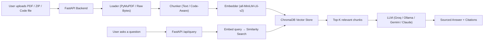
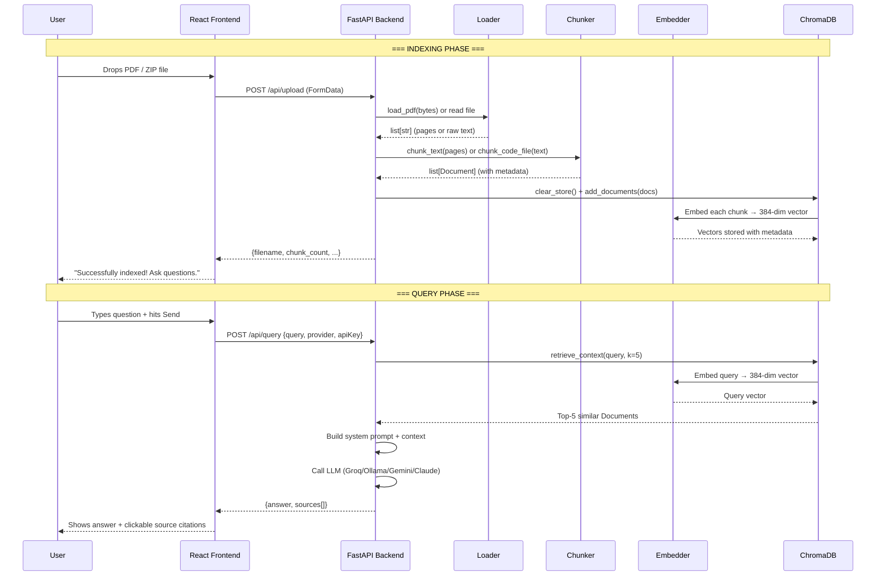

# QueryMind — Complete Project Walkthrough & Interview Guide

## System Overview

**QueryMind** is a full-stack **Retrieval-Augmented Generation (RAG)** application that lets users upload a PDF document or a source code repository, then ask natural-language questions and receive **answers sourced strictly from the uploaded content** — no hallucinations, no external knowledge.



---

## Architecture: Two Halves

| Layer | Tech Stack | Purpose |
|-------|-----------|---------|
| **Frontend** | React 19 + Vite 8 | Upload UI, chat interface, source inspector |
| **Backend** | FastAPI + Python 3.13 | RAG pipeline orchestration, LLM proxy |
| **Vector DB** | ChromaDB (local, persistent) | Semantic similarity search |
| **Embeddings** | HuggingFace `all-MiniLM-L6-v2` | Local, free, 384-dim sentence embeddings |
| **LLM** | Groq / Ollama / Gemini / Claude | Answer generation (user-configurable) |

---

## File-by-File Breakdown

### Backend Files

---

#### [main.py](file:///f:/querymind/backend/main.py) — FastAPI Server & RAG Orchestrator

**Purpose**: The central hub. Defines all API endpoints and proxies LLM calls.

**Key concepts for interviews:**

1. **Endpoints** (4 routes):
   - `GET /api/status` — Returns current workspace state (filename, type, chunk count)
   - `POST /api/upload` — Accepts PDF / code file / ZIP, processes through the RAG pipeline, indexes into ChromaDB
   - `POST /api/query` — Searches ChromaDB for relevant context, builds a constrained prompt, sends to the user's chosen LLM
   - `POST /api/clear` — Purges ChromaDB and resets state

2. **LLM Client Functions** (4 providers):
   - [query_groq](file:///f:/querymind/backend/main.py#L56-L76) — OpenAI-compatible chat completion via Groq's free API
   - [query_ollama](file:///f:/querymind/backend/main.py#L79-L104) — Calls local Ollama server (`/api/chat`)
   - [query_gemini](file:///f:/querymind/backend/main.py#L107-L136) — Google Generative AI REST API
   - [query_claude](file:///f:/querymind/backend/main.py#L139-L161) — Anthropic Messages API

3. **Upload routing** (lines 192–288):
   - ZIP files → iterate entries, filter hidden/ignored dirs, use `chunk_code_file()` per file
   - Individual code files → direct `chunk_code_file()`
   - PDFs → `load_pdf()` then `chunk_text()`
   - After chunking, `clear_store()` then `add_documents()`

4. **System prompt** (lines 341–349): Forces the LLM to answer **only** from retrieved context. If the answer isn't in the context, it must say "I cannot find the answer."

> **Interview tip**: This system prompt is the key to preventing hallucinations in a RAG system. The LLM has no memory — every answer must be grounded in the retrieved chunks.

---

#### [rag/loader.py](file:///f:/querymind/backend/rag/loader.py) — PDF Text Extraction (Stage 1)

**Purpose**: Extracts raw text from PDF bytes using **PyMuPDF** (imported as `fitz`).

**Key function**: [load_pdf](file:///f:/querymind/backend/rag/loader.py#L16-L64)

```python
def load_pdf(file_bytes: bytes) -> list[str]:
    doc = fitz.open(stream=file_bytes, filetype="pdf")
    pages = [page.get_text("text").strip() for page in doc]
    return pages
```

**Interview talking points:**
- Accepts **bytes** (not file path) because FastAPI gives uploaded files as in-memory bytes
- Returns one string per page — preserves page numbering for citations
- Validates: zero pages → error; all empty pages → likely a scanned/image PDF
- `filetype="pdf"` is mandatory when passing bytes (no file extension to auto-detect)

---

#### [rag/chunker.py](file:///f:/querymind/backend/rag/chunker.py) — Text Chunking (Stage 2 — DocMode)

**Purpose**: Splits full-page text into small, overlapping chunks while preserving page metadata.

**Key function**: [chunk_text](file:///f:/querymind/backend/rag/chunker.py#L112-L153)

**How it works:**
1. Uses LangChain's `RecursiveCharacterTextSplitter` with `chunk_size=500`, `chunk_overlap=100`
2. **Recursive splitting hierarchy**: `\n\n` → `\n` → ` ` → character-level
3. Each chunk gets metadata `{"page": page_number}` for citation

**Fallback implementation** (lines 19–109): If LangChain's text splitter isn't available, a complete custom Python implementation is provided. This is a **defensive coding pattern** — making the system resilient to dependency issues.

> **Interview Q**: *"Why overlap?"*  
> **A**: Overlap ensures that sentences split across chunk boundaries are still captured. Without overlap, a question about content near a boundary would miss context.

---

#### [rag/code_chunker.py](file:///f:/querymind/backend/rag/code_chunker.py) — Code-Aware Chunking (Stage 2 — CodeMode)

**Purpose**: Splits source code by **language-aware boundaries** (functions, classes) instead of arbitrary character counts.

**Key function**: [chunk_code_file](file:///f:/querymind/backend/rag/code_chunker.py#L37-L96)

**How it works:**
1. Maps file extension to a LangChain `Language` enum (Python, JS, TS, Go, Java, etc.)
2. Uses `RecursiveCharacterTextSplitter.from_language()` — this uses language-specific separators
3. Tracks `start_line` and `end_line` by finding each chunk's position in the original source
4. Falls back to generic text splitting for unsupported extensions

**Language mapping** (lines 19–35):
```python
EXTENSION_MAPPING = {
    ".py": Language.PYTHON,
    ".js": Language.JS,
    ".tsx": Language.TS,
    ".java": Language.JAVA,
    # ... 13 languages total
}
```

> **Interview Q**: *"Why not just split code on line counts?"*  
> **A**: Splitting mid-function destroys the logical unit. A retriever searching for "how does the auth function work" needs the complete function body, not half of it. Language-aware splitting respects AST boundaries (class/function definitions).

---

#### [rag/embedder.py](file:///f:/querymind/backend/rag/embedder.py) — Embedding Model (Stage 3)

**Purpose**: Converts text chunks into 384-dimensional vectors for semantic search.

**Key function**: [get_embedder](file:///f:/querymind/backend/rag/embedder.py#L15-L29)

```python
_embedder_instance = HuggingFaceEmbeddings(
    model_name="sentence-transformers/all-MiniLM-L6-v2",
    model_kwargs={'device': 'cpu'},
    encode_kwargs={'normalize_embeddings': True}
)
```

**Design decisions:**
- **`all-MiniLM-L6-v2`**: 22M params, 384 dimensions — fast enough for CPU inference
- **Singleton pattern**: Model loaded once, cached in `_embedder_instance`
- **Normalized embeddings**: Enables cosine similarity via dot product (faster)
- **100% offline**: No API key needed for embeddings

> **Interview Q**: *"Why not use OpenAI embeddings?"*  
> **A**: Cost and privacy. Local embeddings are free, don't send data to third parties, and have zero latency from network calls. For a document Q&A tool, `all-MiniLM-L6-v2` provides excellent quality for its size.

---

#### [rag/retriever.py](file:///f:/querymind/backend/rag/retriever.py) — Vector Store & Search (Stage 4)

**Purpose**: Manages ChromaDB — indexing documents and retrieving semantically relevant chunks.

**Key functions:**
- [add_documents](file:///f:/querymind/backend/rag/retriever.py#L34-L42) — Embeds and stores Document objects
- [retrieve_context](file:///f:/querymind/backend/rag/retriever.py#L44-L57) — Similarity search for top-K chunks
- [clear_store](file:///f:/querymind/backend/rag/retriever.py#L59-L87) — Purges DB directory
- [get_chunk_count](file:///f:/querymind/backend/rag/retriever.py#L89-L99) — Returns indexed chunk count

**Architecture details:**
- ChromaDB stores vectors + metadata + original text locally in `chroma_db/` directory
- Singleton pattern via `_db_instance` — avoids re-initializing the embedding model
- `clear_store()` does a full `shutil.rmtree()` to guarantee clean state

> **Interview Q**: *"How does similarity_search work internally?"*  
> **A**: The query text is embedded into the same 384-dim vector space. ChromaDB then computes cosine similarity between the query vector and all stored vectors, returning the top-K most similar chunks. This is why normalized embeddings matter — cosine similarity reduces to a dot product.

---

#### [rag/__init__.py](file:///f:/querymind/backend/rag/__init__.py) — Package Marker

Makes `rag/` a Python package so we can do `from rag.loader import load_pdf`.

---

#### [.env](file:///f:/querymind/backend/.env) — Environment Configuration

Stores optional API keys. The system works without any keys if using Ollama (local) or Groq (free tier).

---

#### [requirements.txt](file:///f:/querymind/backend/requirements.txt) — Python Dependencies

| Package | Why |
|---------|-----|
| `fastapi` | REST API framework |
| `uvicorn` | ASGI server to run FastAPI |
| `langchain` / `langchain-core` | Document abstractions + text splitters |
| `langchain-community` | ChromaDB integration via LangChain |
| `langchain-huggingface` | HuggingFace embedding wrapper |
| `langchain-text-splitters` | Language-aware code splitting |
| `chromadb` | Local vector database |
| `pymupdf` | PDF parsing (imported as `fitz`) |
| `sentence-transformers` | Underlying model loading |
| `python-dotenv` | `.env` file loading |
| `python-multipart` | Required by FastAPI for file uploads |
| `requests` | HTTP client for LLM API calls |

---

### Frontend Files

---

#### [App.jsx](file:///f:/querymind/frontend/src/App.jsx) — Main React Component

**Purpose**: Single-component app managing the entire UI: sidebar config, file upload, chat, and source inspector.

**State architecture** (lines 18–46):
```
Settings:     provider, apiKey, baseUrl, model
Upload:       activeMode, uploading, dragActive, docStatus
Chat:         messages[], query, querying, errorMsg
Inspector:    inspectorOpen, activeSources, selectedSource
```

**Key flows:**

1. **Provider switching** (lines 49–57): When `provider` changes, loads saved API key/URL/model from `localStorage` keyed by provider name
2. **File upload** (lines 123–159): Creates `FormData`, POSTs to `/api/upload`, updates `docStatus` on success
3. **Query** (lines 162–204): POSTs to `/api/query` with user question + provider config, appends response to `messages`
4. **Source Inspector** (lines 489–530): Side drawer showing retrieved chunks with file/page metadata

**UI layout**:
```
┌────────────┬─────────────────────────────────────┐
│  Sidebar   │  Workspace Header (status bar)      │
│  - Mode    ├─────────────────┬───────────────────┤
│  - API     │  Chat Panel     │  Source Inspector  │
│  - Model   │  (messages)     │  (retrieved chunks)│
│  - Reset   │  [input bar]    │                   │
└────────────┴─────────────────┴───────────────────┘
```

---

#### [index.css](file:///f:/querymind/frontend/src/index.css) — Design System

**Theme**: "Aura Dark" — deep navy backgrounds with indigo/purple accent gradients.

**Key design tokens:**
- Glassmorphism: `backdrop-filter: blur(16px)` on cards
- Custom scrollbars matching the dark theme
- Gradient logo with box-shadow glow
- Micro-animations: floating upload icon, fade-in messages, loading dots wave
- Source pills with hover state transitions

---

#### [main.jsx](file:///f:/querymind/frontend/src/main.jsx) — React Entry Point

Standard Vite entry — mounts `<App />` into `<div id="root">` with StrictMode.

---

#### [index.html](file:///f:/querymind/frontend/index.html) — HTML Shell

Contains SEO meta tags, viewport config, and loads the Vite module entry.

---

## The RAG Pipeline — End to End



---

## Interview Q&A Preparation

### Q1: "What is RAG and why use it?"

**RAG (Retrieval-Augmented Generation)** augments an LLM with external knowledge at inference time. Instead of relying on the model's training data (which can be stale or fabricated), we:

1. **Retrieve** relevant document chunks using semantic search
2. **Augment** the prompt with those chunks as context
3. **Generate** an answer constrained to that context

**Why?** It solves three LLM problems:
- **Hallucination** — the model can only reference provided context
- **Knowledge cutoff** — your documents can be anything, any date
- **Privacy** — your data never enters the model's training set

---

### Q2: "Why ChromaDB over FAISS / Pinecone?"

| Feature | ChromaDB | FAISS | Pinecone |
|---------|----------|-------|----------|
| Setup | `pip install` | Compile step | Cloud service |
| Metadata | Built-in | Manual | Built-in |
| Persistence | Local directory | Manual save/load | Cloud |
| Cost | Free | Free | Paid |
| Best for | Prototyping, small-medium data | Large-scale, performance-critical | Production SaaS |

ChromaDB was chosen because it's zero-config, stores metadata alongside vectors, and persists to disk — perfect for a local RAG tool.

---

### Q3: "How do you prevent hallucinations?"

Three layers of defense:

1. **System prompt constraint**: "Answer ONLY from the retrieved context. If the answer isn't there, say 'I cannot find the answer.'"
2. **Temperature = 0.0**: Minimizes creative/random generation
3. **Source citations**: Every answer comes with the exact chunks it was derived from, allowing the user to verify

---

### Q4: "Why split code differently from documents?"

Documents have natural paragraph boundaries. Code has **logical boundaries** (functions, classes, imports). Splitting a function in half makes both halves meaningless for retrieval.

`RecursiveCharacterTextSplitter.from_language()` uses language-specific separators:
- **Python**: splits on `\nclass `, `\ndef `, `\n\n`
- **JavaScript**: splits on `\nfunction `, `\nconst `, `\nclass `

This preserves complete logical units as retrieval targets.

---

### Q5: "What is the embedding model doing?"

The sentence-transformer (`all-MiniLM-L6-v2`) maps text to a 384-dimensional vector where **semantically similar texts have nearby vectors**. 

For example:
- "How to authenticate users" and "def login(username, password)" would have high cosine similarity
- "How to authenticate users" and "CSS border-radius" would have low cosine similarity

This enables **semantic search** — finding relevant content even when the exact words don't match.

---

### Q6: "Walk me through a query lifecycle"

1. User types: *"What does the login function do?"*
2. Frontend sends `POST /api/query` with the question + provider config
3. Backend embeds the question into a 384-dim vector
4. ChromaDB finds the 5 most similar stored chunks (cosine similarity)
5. Backend builds a prompt: system instructions + 5 context blocks + the question
6. The prompt is sent to the chosen LLM (e.g., Groq's Llama 3.3)
7. LLM generates an answer referencing only the context
8. Backend returns `{answer, sources[]}` where each source has file/page/line metadata
9. Frontend renders the answer with clickable source pills
10. User clicks a source pill → Inspector drawer shows the raw retrieved chunk

---

## How to Run

### Backend
```bash
cd f:\querymind\backend
pip install -r requirements.txt
uvicorn main:app --reload --port 8000
```

### Frontend
```bash
cd f:\querymind\frontend
npm install
npm run dev
```

Then open `http://localhost:5173` in your browser.

### Quick Test (no LLM needed)
```bash
cd f:\querymind\backend
python test_rag.py
```
This tests the full RAG pipeline (chunk → embed → store → retrieve) without needing an LLM API key.
